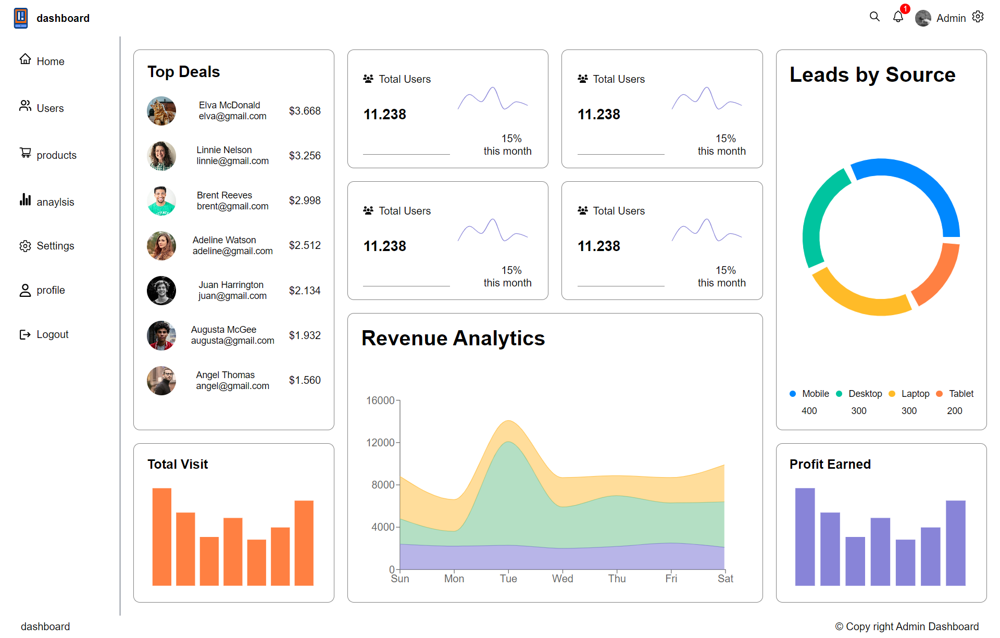

# React Dashboard 
view demo [Link demo ](https://react-dashbord-basem.netlify.app/)
## React Dashbord show stochastic chart (bar , pie and bar chart) based on the data come from backend in special format 
### i handel the backend data by node js and express it is just end point return the data you can find the repo here [dashboard backennd repo](https://github.com/basemsala7/dashboard-backend)
   

in this app i used : 
1. react with typescript
2. rechart
3. react query to cach the data

the app consest of dashboard , user , prodacts 

dashboard -> show the stochastic and charts 
users -> show the info about users and you can view details in the action columns
products -> show the info about products and you can delete the product by clicking on delete icon in the action columns
and you can logout 

the setting is just UI and the notification and search icon

